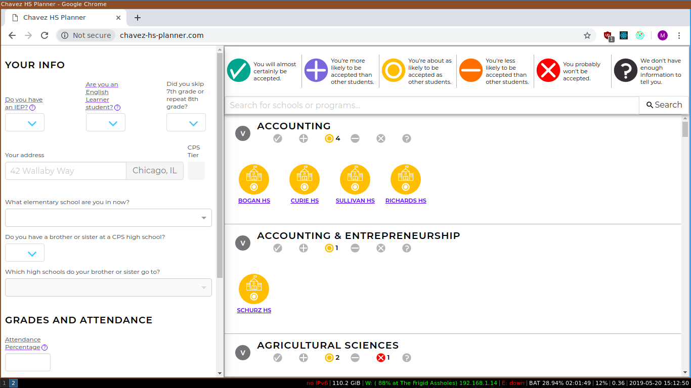

# Chavez Highschool Planner

The Chavez Highschool Planner is a web app shows students their chances of being accepted to any CPS high school, based on the student's current attendance, grades, and standardized test scores.

The Chavez HS Planner is still under active development, and contributions are encouraged. See the open [issues](https://github.com/mpingram/chavez-hs-planner/issues) for more information.

## Running the web app locally

These instructions will get you a copy of the project up and running on your local machine for development and testing purposes.

You'll need to have Node.js installed on your machine. Once you've installed Node, navigate to the directory where you've cloned the repository and run

    npm install

This will install the project's dependencies. Then, run

    npm start

to run the website locally.

## Running the tests

To run the unit tests, run

    npm test

at the project level.

## License

This project is licensed under the GNU GPL v3.
